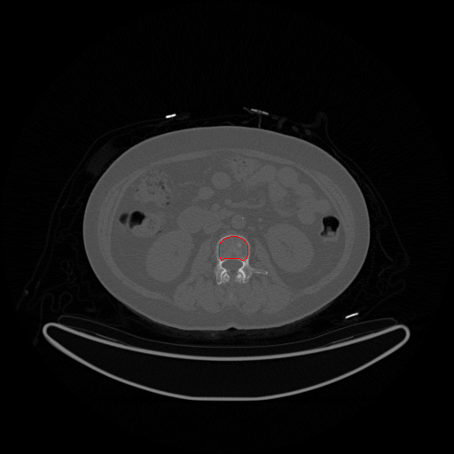
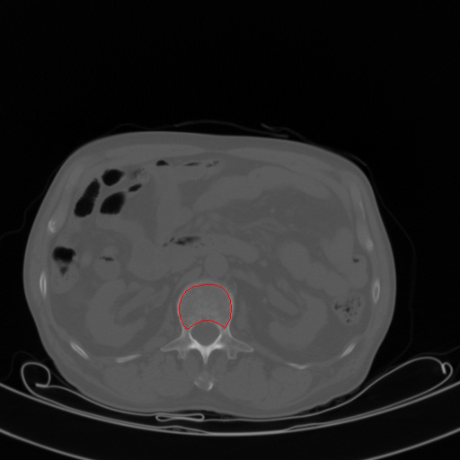
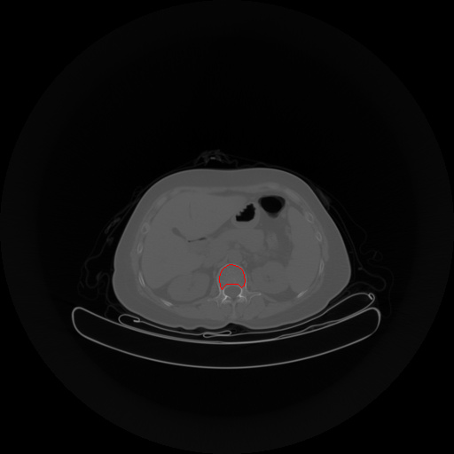
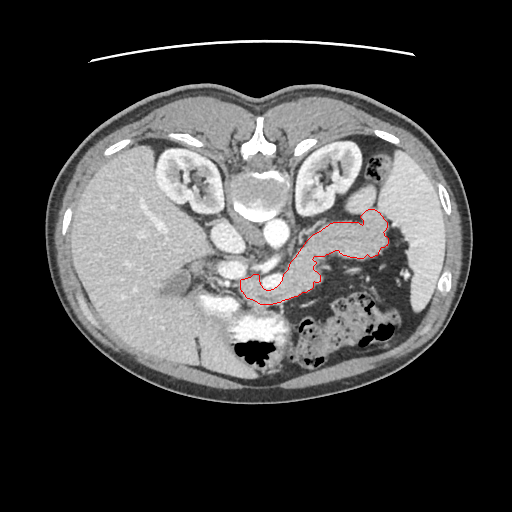
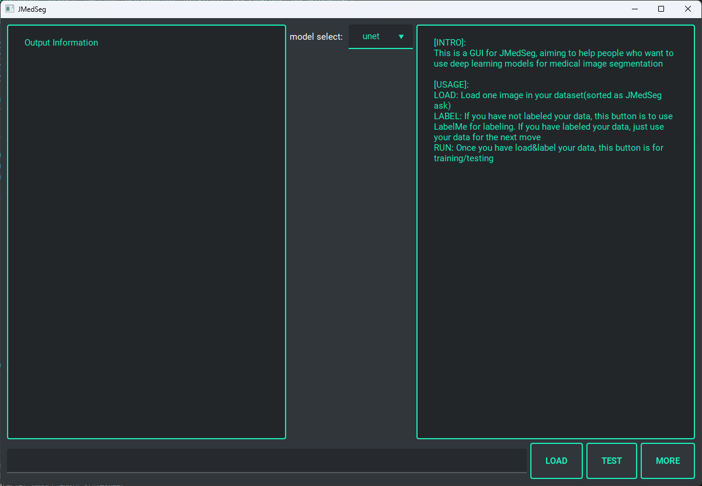

# The deep learning models for segmenting cancellous bone of lumbar vertebrae in CT image.

This framework contains lots of  neural networks for image segmentation, which based on [Jittor](https://cg.cs.tsinghua.edu.cn/jittor/). For convience to  medical specilists, we provide UI(base on PyQt).

## Model Lists
Image segmentation models this framework contains are listed bellow:
- UNet
- SegNet
- DeepLab V2
- DANet
- EANet
- HarDNet and HarDNet_alter
- PSPNet
- OCNet
- OCRNet
- DLinkNet
- AttentionUNet
- UNet++
- UNet+++
- DenseUNet
- TernausNet
- CSNet
- SCSENet
- U2Net
- U2Net-small(lighter verision of U2Net)
- Multi-ResUNet
- R2 UNet
- R2 Attention UNet
- LightNet
- OneNet(lighter version of UNet)
- CENet
- LRF-EANet
- SimpleUNet
- SETR


## Datasets

### Lumbar spine cancellous segmentation dataset
### 
Peking union medical college hospital(PUMCH) and Zhongshan Hospital，Fudan University provided lumbar spine cancellous segmentation dataset.

**PUMCH dataset** 
selected and labeled CT films of lumbar spine 3, lumbar spine 4:


- **train data**：includes a total of 1,442 lumbar spine CT films from 85 individuals

- **validation data**：includes 31 individuals with a total of 549 lumbar spine CT films

- **test data**includes 36 individuals totaling 615 lumbar CT films

One sample of PUMCH datasets:



**Zhongshan Hospital Dataset**was used to test the model's generalization performance across datasets,  containig both large and small image types, and CT slices of lumbar vertebrae 1, and lumbar vertebrae 2 were selected and labeled. Among them：

- **large image**：includes 134 individuals totaling 858 lumbar spine CT films

- **small image**：includes 134 individuals totaling 868 lumbar spine CT films

Below are sample large and small plots of the Zhongshan Hospital Dataset, respectively:





### Pancreas segmentation dataset

including:

- **train data**：includes 8 individuals totaling 1,720 CT films

- **validation data**：includes 2 individuals totaling 424 CT films

- **test data**：includes 2 individuals totaling 401 CT films




### Download URL
[Tsinghua Cloud Drive](https://cloud.tsinghua.edu.cn/f/7be467b07b6f4ffe8a55/) After downloading the data, extract the zip file to the `. /data` folder.


## How to run

1. Configure the appropriate environment and install the latest version of [Jittor](https://github.com/Jittor/jittor).

2. Download Datasets

3. Download some of the [ImageNet pre-trained weights](https://cloud.tsinghua.edu.cn/f/f299d34ed5fb4022a88c/?dl=1) necessary for the model and unzip them into the `model/` directory.

4. If you want to use the trained model parameters, you can download the trained model parameters on the pancreas data [here](https://cloud.tsinghua.edu.cn/de04275bb8248461a8898/), or you can download the [visualization results](https://cloud.tsinghua.edu.cn/d/71b56f28905149a5a610/) to observe the model results first.

5. Run training/testing/visualization

```
usage: run.py [-h]
              [--model {unet,hrnet,setr,unet3p,segnet,hardnet,deeplab,pspnet,danet,eanet,ocrnet,resunet,ocnet,attunet,dense,dlink,ternaus,scseunet,r2,r2att,csnet,unetpp,unetppbig,multires,u2net,u2netp,onenet,lightnet,cenet,setr,hardalter,lrfea,simple}]
              [--pretrain] [--checkpoint CHECKPOINT] --dataset
              {xh,xh_hard,zs_big,zs_small,pancreas} --mode
              {train,test,predict,debug} [--load LOAD] [--aug] [--cuda]
              [--stn] [-o {Adam,SGD}] [-e EPOCHS] [-b BATCH_SIZE] [-l LR]
              [-c CLASS_NUM] [--loss LOSS] [-w BCE_WEIGHT] [-r RESULT_DIR]
              [--poly]

optional arguments:
  -h, --help            show this help message and exit
  --model {unet,hrnet,setr,unet3p,segnet,hardnet,deeplab,pspnet,danet,eanet,ocrnet,resunet,ocnet,attunet,dense,dlink,ternaus,scseunet,r2,r2att,csnet,unetpp,unetppbig,multires,u2net,u2netp,onenet,lightnet,cenet,setr,hardalter,lrfea,simple}
                        choose the model
  --pretrain            whether to use pretrained weights
  --checkpoint CHECKPOINT
                        the location of the pretrained weights
  --dataset {xh,xh_hard,zs_big,zs_small,pancreas}
                        choose a dataset
  --mode {train,test,predict,debug}
                        select a mode
  --load LOAD           the location of the model weights for testing
  --aug                 whether to use color augmentation
  --cuda                whether to use CUDA acceleration
  --stn                 whether to use spatial transformer network
  -o {Adam,SGD}, --optimizer {Adam,SGD}
                        select an optimizer
  -e EPOCHS, --epochs EPOCHS
                        num of training epochs
  -b BATCH_SIZE, --batch-size BATCH_SIZE
                        batch size for training
  -l LR, --learning-rate LR
                        learning rate
  -c CLASS_NUM, --class-num CLASS_NUM
                        pixel-wise classes
  --loss LOSS           Choose from 'ce', 'iou', 'dice', 'focal', if CE loss
                        is selected, you should use a `weight` parameter
  -w BCE_WEIGHT         use this weight if BCE loss is selected; if w is
                        given, then the weights for positive and negative
                        classes will be w and 2.0 - w respectively
  -r RESULT_DIR, --resultdir RESULT_DIR
                        test result output directory
  --poly                whether to use polynomial learning rate scheduler
```

6. Running comparative learning pre-training

```
usage: run_ssl.py [-h]
                  [--model {unet,hrnet,setr,unet3p,segnet,hardnet,deeplab,pspnet,danet,eanet,ocrnet,resunet,ocnet,attunet,dense,dlink,ternaus,scseunet,r2,r2att,csnet,unetpp,unetppbig,multires,u2net,u2netp,onenet,lightnet,cenet,setr,hardalter,lrfea,simple}]
                  --dataset {xh,xh_hard,zs_big,zs_small,pancreas}
                  [--save SAVE] [-e EPOCHS] [-c CLASS_NUM] [-b BATCH_SIZE]
                  [--channel EMBEDDING_CHANNEL] [--layer LAYER] [--lr LR]
                  [--pretrain]

optional arguments:
  -h, --help            show this help message and exit
  --model {unet,hrnet,setr,unet3p,segnet,hardnet,deeplab,pspnet,danet,eanet,ocrnet,resunet,ocnet,attunet,dense,dlink,ternaus,scseunet,r2,r2att,csnet,unetpp,unetppbig,multires,u2net,u2netp,onenet,lightnet,cenet,setr,hardalter,lrfea,simple}
                        choose a model network
  --dataset {xh,xh_hard,zs_big,zs_small,pancreas}
                        select a dataset
  --save SAVE           model weights save path
  -e EPOCHS, --epochs EPOCHS
                        number of training epochs
  -c CLASS_NUM, --class-num CLASS_NUM
                        class number
  -b BATCH_SIZE, --batch-size BATCH_SIZE
                        training batch size
  --channel EMBEDDING_CHANNEL
                        number of channels of embedded feature maps
  --layer LAYER         layer to extract features from
  --lr LR               learning rate
  --pretrain
```

**Run Demo**
Please refer `train.sh`, `batch_test.sh`, `pretrain.sh`


## Run via GUI

